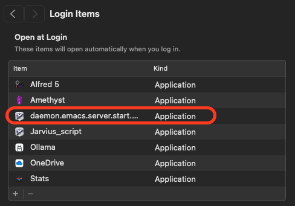
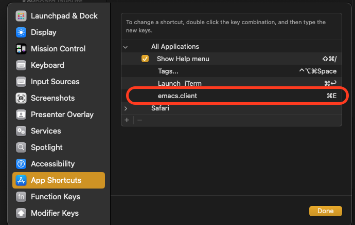
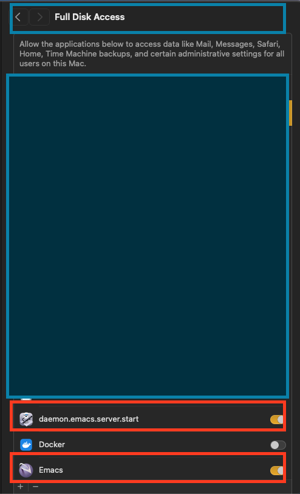
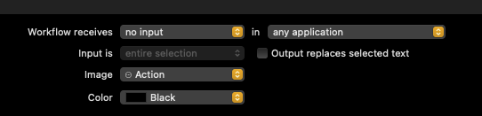

# Emacs Server-Client Premier

The following workflow is to run the emacs in the most efficient way, we will
use the following structure. We will use the `macs daemon` server to run in
background and then connect to it using the `emacsclient` to connect to it.

## Steps of Developement

```sh
+--------------+                   +---------------------------+
|    emacs     |  -> running  ->   |  emacs server (background)|
+--------------+     (daemon)      +---------------------------+
                                                |
                                                v

                                         Running Emacs client   <- keybinding added (command + e)
                                        --------------------
                                                |
             command is running                 |
               on same socket      ------>      |
               -------------                    v
                                        +------------------+
                                        |   emacsclient    |
                                        +------------------+
```

- [x] Running the script on start using the `emacs --daemon`.
  - [x] The script should be in Automator.
  - [x] Running on macOS startup.
- [x] Running the script that lunch the window frame using the `emacsclient`.
  - [x] creating the script in Automator
  - [x] connect it to the server with the `--socket` that created in `emacs --daemon`.
  - [x] Rnning with the command (command + e) to launch a new frame (window)

## A. Pre-requisites

1. The follow is required to be stopped at first, change the following settings
   for your ~/.spacemacs file settings as shown below:

```lisp
;; If non-nil, start an Emacs server if one is not already running.
;; (default nil)
(dotspacemacs-enable-server nil)
;; Set the emacs server socket location.
;; If nil, uses whatever the Emacs default is, otherwise a directory path
;; like \"~/.emacs.d/server\". It has no effect if
;; `dotspacemacs-enable-server` is nil.
;; (default nil)
(dotspacemacs-server-socket-dir nil)
;; If non-nil, advise quit functions to keep server open when quitting.
;; (default nil)
(dotspacemacs-persistent-server nil)
```

## 1. Installation

### 1.1 Running daemon in backgroud

1. Now, we run the `applescript` that will launch the `emacs daemon` when we loggin to our machine

- This will run every time you log in to your machine.
- We assign the name `daemon.emacs.server.start.login` for this purpose.
- Then, we go to the mac setting to add it to the login process, which will launch the script at startup as we specified.
- server name can be any name, I here used `server_ghasak_01`.

```applescript
on run {input, parameters}
      (* Your script goes here *)
      do shell script "/opt/homebrew/bin/emacs --daemon=server_ghasak_01"
      return input
end run
```



### 1.2. Calling the emacs using emacs client

1. Now, we add the script that will launch to us a window based on the server that we specified using:

- We give the follow scrpt a name lets call it `emacs.client`.

```applescript
on run {input, parameters}
	(* Your script goes here *)
	do shell script "/opt/homebrew/bin/emacsclient -n -c --socket-name=server_ghasak_01 -a 'emacs' ~/."
	display notification "Emacsclient launched" with title "Quick Action"
	return input
end run
```

2. Assign a keybinding to make it running efficiently

- This will run with -n or `--no-waiting` to launch the client from the same
  server that we specified eariler, but we need to assign a key to make it
  effective.
- We assign the key `command + e` to make it run this script using

  - Go to the keyboard setting from macOS general settings.
  - Add the keybinding using the setting as shown here:

  

### 1.3. Ensure Permission

You need to check the following settings to ensure all scripts are running
without a problem. All these setttings are located at privacy and security then
you determine which group to allow permission, these below the one I used.

- Full disk access
- Script Accessbility
- Sending key Accessbility
- Automation access



## B. More options

- I found that the loggin server mentioned above will not read my user-config
  file properly:
  - Org mode has a probelmm wiht aligned text and
  - The check-boxes will reseted not by the icons I specified.
  - The header which replaced the title-bar will have a different color
- Given all these, Instead, I decided to run the emacs manually the server using the
  following command (you need to run this command only once, which will run in background by passing & ).

```sh
alias myemacs="/opt/homebrew/bin/emacsclient -n -c --socket-name=server_ghasak_01 -a 'emacs' ~/. &"
```

- Then, later I just need to second part, which means that we run `emacsclient` using the `command + e`.

## C. How to stop the server

1. Easy way to use `fkill` and search for emacs, you will properly find it with the name like:
   - `/opt/homebrew/Cellar/emacs-plus@30/30.0.50/Emacs.app/Contents/MacOS/Emacs --bg-daemon=\0123,4\012server_ghasak_01`
2. Using the specified processor, then pass to kill command

```sh
ps aux | grep Emacs
## or
pgrep -u "$USER" -x Emacs
```

3. Using, the emacsclient itself.

```sh
emacsclient -e '(kill-emacs)'
```

4. Or, in oneliner

```sh
kill -9 $(ps aux | grep Emacs | grep -v grep | awk '{print $2}')
```

## General notes

1. Any applescript to be created must has the following

- It is an applescript from automator with
  - Workflow reciever: `no input` in `any application`
    

2. How to know the location of the socket in macOS

- If you have already a `--daemon` running in background, you just run the following

```sh
 socket_file=$(lsof -c Emacs | grep server | tr -s " " | cut -d' ' -f8) && echo $socket_file
```
