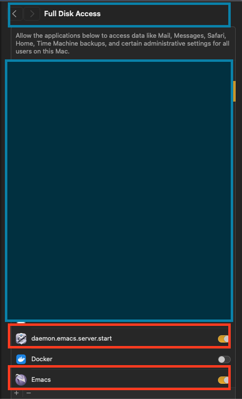
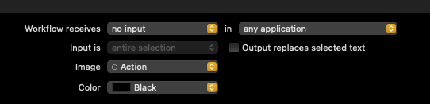

# Premium Emacs Client-Server

## My current workflow

### Steps of Developement

```sh
+--------------+                   +---------------------------+
|    emacs     |  -> running  ->   |  emacs server (background)|
+--------------+     (daemon)      +---------------------------+
                                                |
                                                v

                                         Running Emacs client   <- keybinding added (command + e)
                                        --------------------
                                                |
             command is running                 |
               on same socket      ------>      |
               -------------                    v
                                        +------------------+
                                        |   emacsclient    |
                                        +------------------+
```

- [x] Running the script on start using the `emacs --daemon`.
  - [x] The script should be in Automator.
  - [x] Running on macOS startup.
- [x] Running the script that lunch the window frame using the `emacsclient`.
  - [x] creating the script in Automator
  - [x] connect it to the server with the `--socket` that created in `emacs --daemon`.
  - [x] Rnning with the command (command + e) to launch a new frame (window)

## A. Pre-requisites

After experiemented with many options for the emacs `--daemon` I found several
issues (mentioned here). I got convinced that the best way is to keep the
`spacemacs` works. Now, My work is consists of the following

1. Ensure to allow the server run natively by the `spacemacs` itself, means:

```sh
;; If non-nil, start an Emacs server if one is not already running.
;; (default nil)
(dotspacemacs-enable-server t)
;; Set the emacs server socket location.
;; If nil, uses whatever the Emacs default is, otherwise a directory path
;; like \"~/.emacs.d/server\". It has no effect if
;; `dotspacemacs-enable-server` is nil.
;; (default nil)
(dotspacemacs-server-socket-dir nil)
;; If non-nil, advise quit functions to keep server open when quitting.
;; (default nil)
(dotspacemacs-persistent-server t)
```

## 1. Installation

### 1.1 Running orgianl emacs app in background

1. Now, we run the AppleScript that launches the Emacs app but not passing the `--daemon` when we log in to our machine.
   This will run every time you log in to your machine, as previously stated.

- We have assigned the name "daemon.emacs.server.start.login" for this purpose.
- Then,we proceed to add it to the login process via mac settings to launch the script
  at startup as specified. Here, we will rely on the server name intiated by `.spaceamcs`, which is usually called `server` by default.
- The script will ensure to run the emacs, only once

```applescript
on run {input, parameters}
   -- Wait for 50 seconds
   delay 50

   -- Start Emacs without blocking the script (using & to put the command in the background)
   do shell script "/opt/homebrew/bin/emacs"

   -- Use AppleScript to find and minimize the Emacs window.
   -- Note: This part is pseudo-code and may not work as expected because
   -- controlling GUI applications can be complex and application-specific.
   tell application "System Events"
      set emacsProcess to the first process where its name contains "Emacs"
      set frontmost of emacsProcess to false -- This will not activate Emacs window.
      -- To minimize you may need additional logic to locate the window
      -- and use the 'keystroke' command to simulate a user action to minimize.
   end tell

   return input
end run

```

2. [I used this one], If we do not wish to launch `emacs` automatically when starting up, we can
   simply, run from the terminal session the `emacs` and put it in background
   using

- This command will be run only once, using:

```sh
$ emacs .&
```

- The server in background will be created and it called `server`, and can be
  found using the `socket_file` command (see below).

### 1.2. Calling the emacs using emacs client

1. Now, we add the script that will launch to us a window based on the server that we specified using:

- We give the follow scrpt a name lets call it `emacs.client`.

```applescript
on run {input, parameters}
   (* Your script goes here *)
   do shell script "/opt/homebrew/bin/emacsclient -n -c --socket-name=server -a 'emacs' ~/."
   display notification "Emacsclient launched" with title "Quick Action"
   return input
end run
```

2. Assign a keybinding to make it running efficiently

- This will run with -n or `--no-waiting` to launch the client from the same
  server that we specified eariler, but we need to assign a key to make it
  effective.
- We assign the key `command + e` to make it run this script using

  - Go to the keyboard setting from macOS general settings.
  - Add the keybinding using the setting as shown here:

  

### 1.3. Ensure Permission

You need to check the following settings to ensure all scripts are running
without a problem. All these setttings are located at privacy and security then
you determine which group to allow permission, these below the one I used.

- Full disk access
- Script Accessbility
- Sending key Accessbility
- Automation access



## C. How to stop the server

You will be able to see the running server in the background by using the `fkill` command in its standard format.,

```sh
/opt/homebrew/Cellar/emacs-plus@30/30.0.50/Emacs.app/Contents/MacOS/Emacs
```

1. Using the specified processor, then pass to kill command

```sh
ps aux | grep Emacs
## or
pgrep -u "$USER" -x Emacs
```

2. Using, the emacsclient itself.

```sh
emacsclient -e '(kill-emacs)'
```

3. Or, in oneliner

```sh
kill -9 $(ps aux | grep Emacs | grep -v grep | awk '{print $2}')
```

## General notes

1. Any applescript to be created must has the following

- It is an applescript from automator with
  - Workflow reciever: `no input` in `any application`
    

2. How to know the location of the socket in macOS

- If you have already a `--daemon` running in background, you just run the following

```sh
 socket_file=$(lsof -c Emacs | grep server | tr -s " " | cut -d' ' -f8) && echo $socket_file

```

3. You can kill the loggin server first and then run manually the server using
   `myemacs` command as we mentioned. So, this way, you can have both method.
